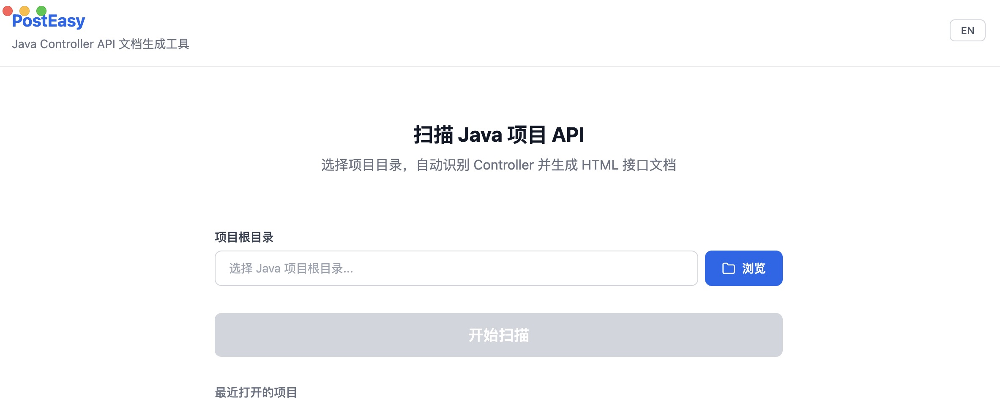
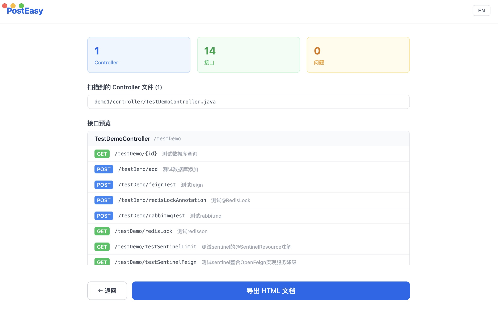
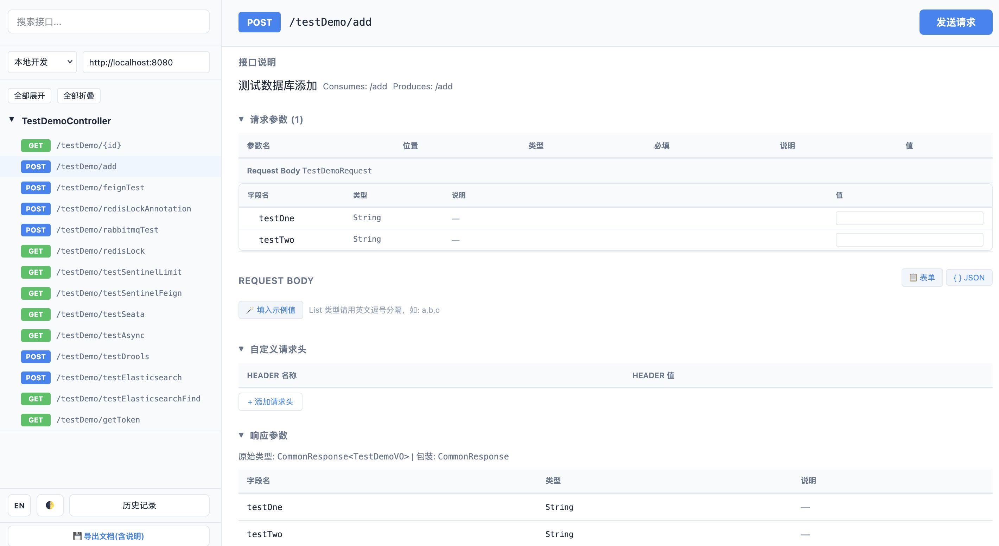

# PostEasy

> 跨平台桌面应用，扫描 Java Spring Controller 源码，一键生成可交互的离线 HTML API 文档。

[English](README_EN.md)

---

## 📑 目录

- [中文介绍](#中文介绍)
  - [功能特性](#功能特性)
  - [安装使用](#安装使用)
  - [HTML 离线文档功能介绍](#html-离线文档功能介绍)
  - [接口说明与字段说明的取值逻辑](#接口说明与字段说明的取值逻辑)
    - [接口树 Controller 名称](#接口树-controller-名称)
  - [注意事项](#注意事项)
  - [开发指南](#开发指南)

---

## 📸 应用截图

| 首页 | 扫描页 |
|------|--------|
|  |  |

| 导出页 | HTML 接口文档 |
|--------|---------------|
|  |  |

---

# 中文介绍

## 功能特性

### 桌面端（Electron 应用）

- **📁 项目扫描** — 选择 Java 项目根目录，自动识别多模块 Maven/Gradle 结构，扫描所有 `*Controller.java` 文件
- **🔍 AST 解析** — 基于 tree-sitter-java 进行源码级 AST 分析，**无需安装 JDK**，开箱即用
- **📊 扫描概览** — 展示 Controller 数量、接口总数、解析问题统计，支持导出错误日志
- **📄 文档导出** — 一键生成自包含的 HTML 接口文档，浏览器直接打开即可使用，无需任何本地服务

### HTML 离线文档（生成后）

- **🌐 在线请求调试** — 内置 HTTP 客户端，支持 GET / POST / PUT / DELETE / PATCH，可直接在文档中调用接口
- **📝 说明编辑** — 接口说明、请求参数说明、响应字段说明均支持**点击编辑**，编辑内容自动持久化到浏览器 localStorage
- **💾 导出文档（含说明）** — 将编辑后的说明嵌入 HTML 文档，导出为新的独立文件，分发给团队即可看到你的补充说明
- **📋 自定义请求头** — 支持添加任意请求头（如 Authorization、X-Token 等），配合请求调试使用
- **🔢 环境切换** — 内置"本地开发 / 测试环境 / 生产环境"三套环境，支持自定义环境，Base URL 独立配置
- **📂 历史记录** — 自动保存最近 50 条请求历史，包含请求参数、请求头、响应状态，支持一键恢复
- **🔎 快速搜索** — 支持按路径/方法名搜索接口，`Ctrl+K` 快捷键聚焦搜索框
- **🎨 主题切换** — 浅色 / 深色 / 跟随系统三种主题模式
- **🌍 中英双语** — 界面支持中文/英文一键切换
- **🔄 请求体视图** — JSON 编辑器与表单字段双视图切换，支持双向同步
- **🪄 示例值填充** — 一键填入请求体字段的示例值（根据类型自动生成）
- **📎 cURL 导出** — 每次请求自动生成 cURL 命令，支持一键复制

### 解析支持范围

| 类别 | 支持内容 |
|------|----------|
| Java 版本 | Java 8 / 11 / 17 / 21+ |
| Spring Boot | 2.x / 3.x / 4.x+ |
| 注解命名空间 | `javax.*` 和 `jakarta.*` 自动适配 |
| HTTP 注解 | `@GetMapping`、`@PostMapping`、`@PutMapping`、`@DeleteMapping`、`@PatchMapping`、`@RequestMapping` |
| 参数注解 | `@RequestParam`、`@PathVariable`、`@RequestBody`、`@RequestHeader`、`@RequestPart`、`@CookieValue` 等 |
| 校验注解 | `@NotNull`、`@NotBlank`、`@NotEmpty`、`@Size`、`@Min`、`@Max`、`@Pattern` 等 20+ 种 |
| Swagger 注解 | `@Operation`、`@ApiOperation`、`@Tag`、`@Api`、`@Schema`、`@ApiModelProperty`、`@Parameter`、`@ApiParam` |
| 响应体类型 | 普通对象、`R`/`Result`/`ResponseEntity` 包装类、`Mono`/`Flux` 响应式、`List`/`Page` 分页、文件下载 |
| DTO 解析 | 自动解析项目内所有 `.java` 文件的字段，支持嵌套对象递归展开（最大深度 5 层），循环引用自动标记 |

---

## 安装使用

### 下载安装

从 [GitHub Releases](https://github.com/tangjindi/PostEasy/releases) 页面下载对应平台的安装包：

| 平台 | 文件 |
|------|------|
| macOS (Apple Silicon) | `PostEasy-1.0.0-mac-arm64.dmg` |
| macOS (Intel) | `PostEasy-1.0.0-mac-x64.dmg` |
| Windows | `PostEasy-Setup-1.0.0-win.exe` |

> **Windows 用户注意**：安装时如遇 SmartScreen 提示，请点击"更多信息" → "仍要运行"。这是因为应用未使用代码签名证书。

### 基本使用流程

1. **启动应用** — 打开 PostEasy
2. **选择项目** — 点击选择 Java Spring Boot 项目根目录（包含 `pom.xml` 或 `build.gradle` 的目录）
3. **开始扫描** — 点击"开始扫描"，应用将自动发现所有 Controller 文件并解析接口
4. **导出文档** — 扫描完成后点击"导出 HTML 文档"，选择保存路径
5. **打开文档** — 用浏览器打开生成的 HTML 文件即可查看和交互

### 多模块项目

PostEasy 会自动检测 Maven/Gradle 多模块结构，扫描所有子模块的 `src/main/java` 目录。为确保完整解析所有 DTO 类和参数类型，请选择项目根目录（包含 `pom.xml` 或 `build.gradle` 的目录）。

---

## HTML 离线文档功能介绍

生成的 HTML 文档是一个**完全自包含**的单文件应用，无需任何网络服务或本地服务器即可运行。

### 左侧边栏
- **搜索框**：按路径或方法名快速过滤接口，`Ctrl+K` 快捷聚焦
- **环境选择器**：切换不同环境的 Base URL，支持自定义添加环境
- **接口树**：按 Controller 分组展示所有接口，支持全部展开/折叠、搜索过滤
- **底部按钮**：主题切换、中英语言切换、历史记录面板、导出文档（含说明）

### 右侧详情区
- **接口说明**：显示接口摘要，**点击即可编辑**
- **请求参数表**：展示参数名、位置、类型、是否必填、说明、值。简单参数直接填值，复杂对象（`@RequestBody`）显示为字段树，**字段说明可点击编辑**
- **Request Body**：支持【表单】和【JSON】双视图切换，表单视图可逐字段填写，JSON 视图可直接编辑 JSON，双向同步
- **自定义请求头**：可动态添加/删除任意请求头（如 `Authorization: Bearer xxx`）
- **响应参数**：展示响应体字段树，**每个字段的说明均可点击编辑**，嵌套对象支持展开/折叠
- **发送请求**：填写参数后点击发送，展示请求详情、响应头、响应体、耗时、状态码，自动生成 cURL 命令

### 导出文档（含说明）

这是 PostEasy 的核心特色功能：

1. 在 HTML 文档中编辑接口说明、参数说明、字段说明
2. 点击左下角 **💾 导出文档(含说明)** 按钮
3. 编辑内容会被嵌入到新生成的 HTML 文件中
4. 将新文件分享给团队成员——对方打开即可看到你补充的所有说明

> **原理**：导出时将 `state.edits` 数据通过 `<script>` 标签嵌入 HTML，并在页面初始化时自动加载合并到文档中。

---

## 接口说明与字段说明的取值逻辑

PostEasy 生成的文档中，"说明"列的取值遵循以下优先级从 Java 源码中提取：

### 接口树 Controller 名称

左侧边栏接口树中，Controller 的分组名称按以下优先级从注解中提取：

| 优先级 | 来源 | 示例 |
|--------|------|------|
| 1（最高） | `@Tag(name = "...")` | `@Tag(name = "用户管理")` → 显示"用户管理" |
| 2 | `@Api("...")` | `@Api("用户管理")` → 显示"用户管理"（value 简写） |
| 3 | `@Api(tags = "...")` | `@Api(tags = "用户管理")` → 显示"用户管理" |
| 4 | `@Api(value = "...")` | `@Api(value = "用户管理")` → 显示"用户管理" |
| 5 | Javadoc 首行 | `/** 用户管理 Controller */` 的第一行 |
| 6（最低） | Java 类名 | 如 `UserController`（兜底值） |

> **注意**：`@Tag` 是 Swagger v3 / OpenAPI 3 注解，`@Api` 是 Swagger v2 / SpringFox 注解。两种命名空间（`javax.*` / `jakarta.*`）均支持。

### 接口说明（方法级 Summary）

| 优先级 | 来源 | 示例 |
|--------|------|------|
| 1（最高） | `@Operation(summary = "...")` | Swagger v3 / SpringDoc |
| 2 | `@ApiOperation(value = "...")` | Swagger v2 / SpringFox |
| 3 | Javadoc 首行 | `/** 获取用户信息 */` 的第一行文字 |
| 4（最低） | 空 | 显示为"无说明" |

### 请求参数说明

| 优先级 | 来源 | 示例 |
|--------|------|------|
| 1（最高） | `@Parameter(description = "...")` | Swagger v3 |
| 2 | `@ApiParam(value = "...")` | Swagger v2 |
| 3 | `/** */` 首行 | Javadoc 块注释第一行非 @tag 文字 |
| 4 | `//` 行注释 | 双斜杠注释（字段上方或同行） |
| 5（最低） | 空 | 需要在文档中手动点击填写 |

### 响应字段 / 请求体字段说明

| 优先级 | 来源 | 示例 |
|--------|------|------|
| 1（最高） | `@Schema(description = "...")` | Swagger v3 |
| 2 | `@ApiModelProperty(value = "...")` | Swagger v2 |
| 3 | `/** */` 首行 | Javadoc 块注释第一行非 @tag 文字，如 `/** 用户名 */` |
| 4 | `//` 行注释 | 双斜杠注释，如 `// 用户名`（字段上方或同行） |
| 5（最低） | 空 | 需要在文档中手动点击填写 |

### 编辑优先级

用户在 HTML 文档中**手动编辑的说明**具有最高优先级，会覆盖上述所有来源的默认值。

### 字段树递归深度

对于嵌套 DTO 对象，PostEasy 会自动展开字段树，最大递归深度为 **5 层**。超过深度限制的字段会标记为"截断"。检测到循环引用（如 A 包含 B，B 包含 A）的字段会标记为"循环引用"。

---

## 注意事项

### Java 项目要求

- 项目必须是 **Maven** 或 **Gradle** 构建的 Spring Boot 项目
- Controller 文件名必须以 `Controller.java` 结尾（如 `UserController.java`）
- `*ControllerImpl.java`、`*ControllerTest.java`、`Abstract*.java` 会被自动排除
- 项目无需编译通过——PostEasy 只做源码级语法解析

### HTTP 请求调试限制

- 生成的 HTML 文档通过浏览器 `fetch` API 发送请求，受浏览器**同源策略**限制
- 如果后端未配置 CORS，请求会被浏览器拦截，显示网络错误提示
- **解决方式**：在后端 Controller 添加 `@CrossOrigin(origins = "*")` 或配置全局 CORS 过滤器
- 如果浏览器**直接访问 URL 也不可达**，请检查 Base URL 是否正确、服务是否启动

### 数据存储

- 编辑的说明、参数值、请求历史均存储在浏览器 **localStorage** 中
- 不同项目的文档使用独立的存储 key（基于项目名称 hash），互不干扰
- 清除浏览器数据会导致编辑内容丢失——请及时使用"导出文档（含说明）"功能保存
- 导出文档（含说明）生成的 HTML 文件是**完全独立的**，内嵌了所有编辑数据，不依赖 localStorage

### Windows 用户

- 安装包未签名，可能触发 SmartScreen 警告
- 如遇中文乱码，请确保项目 Java 文件使用 **UTF-8** 编码
- Windows 构建需要在 Windows 系统上进行（tree-sitter 原生模块不支持 macOS 交叉编译）

### 已知限制

- 不支持 JSP / Thymeleaf 模板中的接口
- 不支持非 Spring Boot 框架（如 JAX-RS、Play Framework）
- 不支持 Kotlin 编写的 Controller（仅解析 `.java` 文件）
- 文件下载类型的响应体（`ResponseEntity<Resource>` 等）标记为"文件下载响应"，不展开字段
- HTTP 请求功能仅支持 JSON 和表单格式，不支持 multipart 文件上传调试

---

## 开发指南

### 环境要求

- Node.js >= 20 LTS
- npm >= 10

### 安装和启动

```bash
npm install
npm run dev
```

### 构建

```bash
npm run build          # 仅构建代码
npm run build:mac      # 构建 macOS DMG 安装包
npm run build:win      # 构建 Windows NSIS 安装包（需在 Windows 上执行）
```

### 测试

```bash
npm run test           # 单元测试 (Vitest)
npm run test:e2e       # E2E 测试 (Playwright)
npm run typecheck      # TypeScript 类型检查
npm run lint           # ESLint 代码规范检查
```

### 项目结构

```
post-easy/
├── electron/              # Electron 主进程
│   ├── main.ts            # 窗口管理 + IPC 通信
│   ├── preload.ts         # contextBridge 安全 API
│   └── ipc/
│       ├── scanner.ts     # Java 文件扫描（多模块识别、应用配置解析）
│       ├── parser.ts      # tree-sitter AST 解析（注解/参数/返回值提取）
│       ├── generator.ts   # Handlebars 模板渲染 → HTML 文档
│       └── __tests__/     # 单元测试
├── src/                   # React 渲染进程
│   ├── pages/             # HomePage / ScanPage / ExportPage
│   ├── components/        # 通用 UI 组件
│   ├── stores/            # Zustand 状态管理
│   └── styles/            # Tailwind CSS
├── templates/
│   └── api-doc.hbs        # HTML 文档模板（含完整 JS SPA 逻辑）
├── test/fixtures/         # 测试用例 Java 文件
├── resources/             # 应用图标
├── electron-builder.yml   # 打包配置
└── package.json
```

### 技术栈

| 层面 | 技术 |
|------|------|
| 桌面框架 | Electron |
| 前端 | React 18 + Vite + Tailwind CSS |
| Java 解析 | tree-sitter-java（零 JDK 依赖） |
| 模板引擎 | Handlebars |
| 状态管理 | Zustand |
| 打包 | electron-builder |
| 测试 | Vitest + Playwright |

---

## License

MIT
